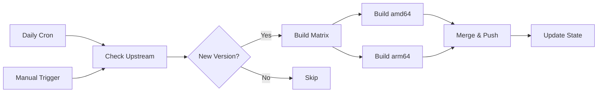

# 🐳 Minimal Docker Image for Flexisip SIP Server

[](https://hub.docker.com/r/etnperlong/flexisip)
[](https://hub.docker.com/r/etnperlong/flexisip)
[](LICENSE)
[](https://github.com/etnperlong/docker-flexisip/actions)
[](https://hub.docker.com/r/etnperlong/flexisip/tags)

A lightweight, production-ready Docker image for [Flexisip](https://gitlab.linphone.org/BC/public/flexisip), the open-source SIP proxy server by Belledonne Communications. This image is optimized for minimal size and maximum efficiency through multi-stage builds and careful dependency management.

## ✨ Features

### 🎯 Lightweight & Efficient
- **Multi-stage build**: Separates build dependencies from runtime, significantly reducing final image size
- **Debian Slim base**: Uses `debian:trixie-slim` for minimal footprint
- **Production-ready**: Contains only essential runtime components, no build tools or documentation
- **Optimized layers**: Careful layer management to minimize image size and improve build cache efficiency

### 🏗️ Build Advantages
- **Automated upstream tracking**: Automatically detects and builds new Flexisip releases
- **Multi-architecture support**: Native builds for both `amd64` and `arm64` platforms
- **Parallel builds**: Matrix strategy for concurrent multi-version builds
- **Channel-based releases**: Separate tracks for `stable`, `alpha`, `beta`, and `edge` versions
- **Version pinning**: Reproducible builds with explicit version tagging

### 🔄 Continuous Integration
- **Automated daily checks**: Monitors upstream repository for new releases
- **Smart versioning**: Automatically categorizes and builds stable, alpha, and beta releases
- **Edge builds**: Tracks master branch commits for bleeding-edge testing
- **GitHub Actions**: Fully automated CI/CD pipeline with matrix builds
- **State management**: Uses GitHub Variables for stateful version tracking

## 📦 Image Variants

| Tag | Description | Update Frequency |
|-----|-------------|------------------|
| `latest` | Latest stable release | On stable release |
| `2.3.2` | Specific version | One-time build |
| `stable` | Latest stable release | On stable release |
| `alpha` | Latest alpha release | On alpha release |
| `beta` | Latest beta release | On beta release |
| `edge` | Latest master commit | Daily (if changes) |
| `edge-{hash}` | Specific commit build | On commit |

## 🚀 Quick Start

### Basic Usage

```bash
# Pull the latest stable version
docker pull etnperlong/flexisip:latest

# Run Flexisip proxy with default configuration
docker run -d \
  --name flexisip \
  -p 5060:5060/udp \
  -p 5060:5060/tcp \
  -v /path/to/config:/usr/local/etc/flexisip \
  -v /path/to/logs:/usr/local/var/log/flexisip \
  etnperlong/flexisip:latest
```

### Custom Configuration

```bash
# Create configuration directory
mkdir -p flexisip-config flexisip-logs

# Run with custom configuration
docker run -d \
  --name flexisip-proxy \
  --restart unless-stopped \
  -p 5060:5060/udp \
  -p 5060:5060/tcp \
  -v $(pwd)/flexisip-config:/usr/local/etc/flexisip \
  -v $(pwd)/flexisip-logs:/usr/local/var/log/flexisip \
  etnperlong/flexisip:latest \
  --server
```

### Docker Compose

```yaml
version: '3.8'

services:
  flexisip:
    image: etnperlong/flexisip:latest
    container_name: flexisip-proxy
    restart: unless-stopped
    ports:
      - "5060:5060/udp"
      - "5060:5060/tcp"
    volumes:
      - ./config:/usr/local/etc/flexisip
      - ./logs:/usr/local/var/log/flexisip
    command: ["--server"]
```

## 🔧 Configuration

Flexisip configuration files should be placed in `/usr/local/etc/flexisip/`. The default configuration will be generated on first run if not provided.

### Volume Mounts

- `/usr/local/etc/flexisip` - Configuration directory
- `/usr/local/var/log/flexisip` - Log directory

### Exposed Ports

- `5060/udp` - SIP signaling (UDP)
- `5060/tcp` - SIP signaling (TCP)

For additional ports and configuration options, refer to the [official Flexisip documentation](https://wiki.linphone.org/xwiki/wiki/public/view/Flexisip/).

## 🛠️ Building from Source

### Prerequisites

- Docker with BuildKit support
- Git

### Build Commands

```bash
# Clone the repository
git clone https://github.com/etnperlong/docker-flexisip.git
cd docker-flexisip

# Build for current architecture
docker build \
  --build-arg FLEXISIP_VERSION=2.3.2 \
  --build-arg DEBIAN_VERSION=trixie \
  -t flexisip:local .

# Build for specific architecture
docker buildx build \
  --platform linux/amd64,linux/arm64 \
  --build-arg FLEXISIP_VERSION=2.3.2 \
  -t flexisip:local .
```

### Build Arguments

| Argument | Default | Description |
|----------|---------|-------------|
| `DEBIAN_VERSION` | `trixie` | Debian base image version |
| `FLEXISIP_VERSION` | Required | Flexisip version tag or commit hash |
| `BUILD_TYPE` | `Release` | CMake build type (Release/Debug) |

## 🔄 Automated Builds

This project includes comprehensive GitHub Actions workflows for automated building and publishing.

### Workflow Overview



### Available Workflows

#### 1. **Auto Check Upstream** (`auto-check.yml`)
- **Trigger**: Daily at 02:00 UTC or manual
- **Purpose**: Monitors upstream repository for new releases
- **Features**:
  - Checks stable, alpha, beta, and edge channels
  - Matrix-based parallel builds for efficiency
  - Automatic version detection and categorization
  - State management via GitHub Variables

#### 2. **Manual Build** (`manual-build.yml`)
- **Trigger**: Manual workflow dispatch
- **Purpose**: Build specific versions on demand
- **Features**:
  - Accepts any version tag or commit hash
  - Auto-detects channel from version string
  - Useful for rebuilding or testing specific versions

#### 3. **Docker Build** (`build-docker.yml`)
- **Type**: Reusable workflow
- **Purpose**: Core build logic shared by other workflows
- **Features**:
  - Multi-architecture builds (amd64 + arm64)
  - Digest-based image merging
  - Flexible tagging strategy
  - Artifact caching for speed

### Forking & Customization

To set up automated builds in your own fork:

#### Step 1: Fork the Repository

```bash
# Fork on GitHub, then clone
git clone https://github.com/YOUR_USERNAME/docker-flexisip.git
cd docker-flexisip
```

#### Step 2: Configure Secrets

Navigate to **Settings → Secrets and variables → Actions**

**Required Secrets**:
- `DOCKERHUB_TOKEN`: Your Docker Hub access token ([How to create](https://docs.docker.com/security/for-developers/access-tokens/))
- `PAT`: GitHub Personal Access Token with `variables:write` permission

**Required Variables**:
- `DOCKERHUB_USERNAME`: Your Docker Hub username
- `FLEXISIP_STABLE_VERSION`: Current stable version (leave empty initially)
- `FLEXISIP_ALPHA_VERSION`: Current alpha version (leave empty initially)
- `FLEXISIP_BETA_VERSION`: Current beta version (leave empty initially)
- `FLEXISIP_EDGE_COMMIT`: Current edge commit hash (leave empty initially)

##### Creating the GitHub Personal Access Token (PAT)

The auto-check workflow requires a Personal Access Token to update repository variables because the default `GITHUB_TOKEN` doesn't support this operation.

1. **Go to GitHub Settings**:
   - Click your profile picture → **Settings**
   - Navigate to **Developer settings** → **Personal access tokens** → **Fine-grained tokens**
   - Click **Generate new token**

2. **Configure Token**:
   - **Token name**: `docker-flexisip-variables` (or any descriptive name)
   - **Expiration**: Choose your preferred duration (90 days or custom)
   - **Repository access**: Select "Only select repositories" and choose your fork
   - **Permissions** → **Repository permissions**:
     - **Variables**: Set to **Read and write** access
     - **Actions**: Set to **Read-only** access (optional, for workflow runs)

3. **Generate and Save**:
   - Click **Generate token**
   - **Important**: Copy the token immediately - you won't see it again!
   - Store it in your repository secrets as `PAT`

4. **Add to Repository Secrets**:
   - Go to your repository → **Settings** → **Secrets and variables** → **Actions**
   - Click **New repository secret**
   - Name: `PAT`
   - Value: Paste your generated token
   - Click **Add secret**

> **Why is this needed?** The GitHub Actions default `GITHUB_TOKEN` has limited permissions and cannot modify repository variables. A fine-grained PAT with explicit `variables:write` permission is required for the auto-check workflow to update version tracking variables after successful builds.

#### Step 3: Configure Runners (Optional)

For ARM builds, you need an `arm64` runner:
- **Option A**: Use GitHub-hosted ARM runners (if available)
- **Option B**: Self-host an ARM runner with label `ubuntu-24.04-arm`
- **Option C**: Modify workflows to use QEMU emulation (slower)

#### Step 4: Update Docker Repository

Edit `.github/workflows/build-docker.yml`:

```yaml
env:
  DOCKERHUB_REPO: YOUR_USERNAME/flexisip  # Change this
```

#### Step 5: Enable Workflows

Go to **Actions** tab and enable workflows for your fork.

#### Step 6: Test the Setup

```bash
# Manually trigger a build
Actions → Manual Build → Run workflow
Input version: 2.3.2
```

## 📊 Comparison with Official Images

| Feature | This Project | Official Flexisip |
|---------|-------------|-------------------|
| **Base Image** | Debian Slim | Debian Standard |
| **Image Size** | ~200-300MB | ~500-800MB |
| **Build Stages** | Multi-stage (2) | Single stage |
| **Architectures** | amd64, arm64 | amd64 only |
| **Build Tools** | Excluded from runtime | Included |
| **Automation** | Full CI/CD pipeline | Manual |
| **Release Channels** | stable/alpha/beta/edge | N/A |
| **Update Frequency** | Daily checks | Manual |

## 🤝 Contributing

Contributions are welcome! Please feel free to submit issues or pull requests.

### Development Workflow

1. Fork the repository
2. Create a feature branch (`git checkout -b feature/amazing-feature`)
3. Make your changes
4. Test locally with Docker build
5. Commit your changes (`git commit -m 'feat: add amazing feature'`)
6. Push to the branch (`git push origin feature/amazing-feature`)
7. Open a Pull Request

## 📄 License

This project is licensed under the GNU Affero General Public License v3.0 - see the [LICENSE](LICENSE) file for details.

**Note**: Flexisip itself is licensed under [GNU AGPLv3](https://www.gnu.org/licenses/agpl-3.0.html). This Docker packaging maintains the same license.

## 🔗 Resources

- **Upstream Project**: [Flexisip on GitLab](https://gitlab.linphone.org/BC/public/flexisip)
- **Docker Hub**: [etnperlong/flexisip](https://hub.docker.com/r/etnperlong/flexisip)
- **Documentation**: [Flexisip Wiki](https://wiki.linphone.org/xwiki/wiki/public/view/Flexisip/)
- **Issue Tracker**: [GitHub Issues](https://github.com/etnperlong/docker-flexisip/issues)
- **Linphone Project**: [linphone.org](https://www.linphone.org/)

## 🙏 Acknowledgments

- **Belledonne Communications** for developing and maintaining Flexisip
- **Linphone Community** for extensive SIP expertise and support
- **GitHub Actions** for providing robust CI/CD infrastructure

---

<div align="center">

**[⬆ Back to Top](#-minimal-docker-image-for-flexisip-sip-server)**

Made with ❤️ for the open-source community

</div>